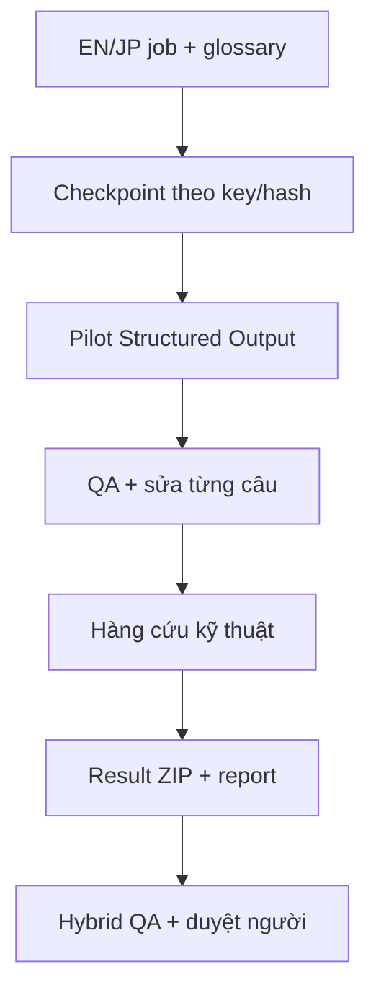

# GBFR Local Translator

Bộ công cụ dịch cục bộ và kiểm định kỹ thuật cho dự án Việt hóa **Granblue Fantasy: Relink**. Công cụ dùng LM Studio và Qwen3.5-9B để tạo bản dịch tiếng Việt theo checkpoint, bảo vệ token/thuật ngữ, tự sửa từng câu bị QA từ chối và xuất báo cáo để tiếp tục hậu kiểm.

> **Trạng thái hiện tại:** Story Complete Worker `v1.8` là bản Worker đã kiểm thử cho giai đoạn tạo baseline. Đây **không phải** patch Việt hóa cài trực tiếp vào game và kết quả `LOCAL_OK`/`REVIEW` chưa đồng nghĩa với bản dịch đã được phê duyệt.

## Bộ công cụ này giải quyết việc gì?

- Chạy AI hoàn toàn trên máy người dùng qua LM Studio.
- Tiếp tục an toàn từ checkpoint sau khi dừng, mất kết nối hoặc khởi động lại.
- Dịch theo batch nhỏ bằng Structured Output JSON Schema.
- Bảo vệ placeholder, printf token, con số và thuật ngữ phải giữ nguyên.
- Phát hiện CJK lọt, English chưa dịch, sai token, sai số và mất protected term.
- Sửa riêng từng câu bị QA từ chối trước khi đưa vào hàng cứu cuối.
- Tách lỗi lịch sử khỏi pilot dữ liệu mới.
- Giữ exact English cho metadata `TXT_CV_*` như tên diễn viên lồng tiếng.
- Xuất checkpoint JSONL, báo cáo JSON và ZIP kết quả để tiếp tục Hybrid QA/build.

## Không có gì trong repository này?

Repository **không** chứa:

- file MSG hoặc dữ liệu trích xuất từ game;
- `story_job.json` thật của dự án;
- glossary đầy đủ của dự án;
- checkpoint, request log, failure log hoặc kết quả dịch;
- patch/bản cài game, font game hay nội dung có bản quyền của nhà phát hành;
- model Qwen hoặc LM Studio.

Người dùng phải tự tạo dữ liệu đầu vào từ bản game mà mình sở hữu hợp pháp. Xem [định dạng đầu vào](docs/INPUT_FORMAT.md).

## Yêu cầu

- Windows 10/11.
- Node.js 20 trở lên.
- LM Studio có Local Server tương thích OpenAI API.
- Model Qwen3.5-9B đã tải trong LM Studio.
- GPU 12 GB VRAM được khuyến nghị cho cấu hình mặc định; bản v1.8 đã được vận hành thực tế trên RTX 4070 Super 12 GB.
- Dung lượng trống cho model, checkpoint và log.

## Bắt đầu nhanh

### Cập nhật từ Worker cũ

1. Tải ZIP tại [`releases/`](releases/README.md).
2. Đóng Worker cũ.
3. Giải nén vào thư mục cha đang chứa `GBFR_Story_Complete_Worker_v1`.
4. Chọn **Replace the files in the destination**.
5. Không xóa `progress` hoặc `data`.
6. Bật LM Studio Local Server tại cổng `1234`.
7. Chạy `01_CHAY_DICH_STORY_COMPLETE.cmd` và xác nhận dòng đầu là `v1.8`.

### Dùng mã nguồn cho một job mới

1. Sao chép thư mục [`story-worker/`](story-worker/README.md) sang một thư mục làm việc riêng.
2. Đổi `config.example.json` thành `config.json`.
3. Tạo `glossary.json` từ `glossary.example.json` và khóa đầy đủ tên/thuật ngữ của corpus.
4. Tạo `data/story_job.json` theo [`story_job.example.json`](story-worker/data/story_job.example.json).
5. Chạy `01_CHAY_DICH_STORY_COMPLETE.cmd`.

Không chạy corpus thật với glossary mẫu rỗng/thiếu. Protected terms phải được khóa trước khi model bắt đầu.

## Luồng vận hành

Chi tiết kiến trúc và cổng an toàn nằm trong [ARCHITECTURE.md](docs/ARCHITECTURE.md).

## Kết quả đầu ra

Worker tạo trong thư mục cục bộ:

| Tệp | Vai trò |
|---|---|
| `progress/story_translations.jsonl` | Checkpoint append-only theo từng kết quả hợp lệ |
| `progress/story_request_log.jsonl` | Thông tin từng request và tốc độ xử lý |
| `progress/story_failed_responses.jsonl` | Phản hồi bị QA/parser từ chối; có thể chứa source |
| `progress/story_translation_report.json` | Tiến độ hoặc báo cáo cuối |
| `GBFR_Story_Translation_Result_v1.zip` | Kết quả bàn giao cho bước QA tiếp theo |

Không đăng các tệp trong `progress/` lên issue công khai nếu chưa xóa source và dữ liệu riêng.

## Chính sách chất lượng

- Raw EN/JP bất biến; mọi thay đổi đi bằng overlay/checkpoint.
- Không auto-merge output chỉ vì JSON hợp lệ.
- `LOCAL_OK` chỉ nghĩa là đạt QA kỹ thuật.
- `REVIEW` cần hậu kiểm ngôn ngữ/ngữ cảnh.
- `TECHNICAL_ERROR` không được đưa vào overlay; pipeline sau phải giữ English source.
- Tên riêng, địa danh, Weapon, item trong shop, Sigil, Trait và Skill đã khóa được giữ English; chỉ dịch mô tả/hiệu ứng.
- Dùng `Cấp độ` hoặc giữ `Level`; không dùng `Mức` cho level nhân vật.

## Tài liệu dự án

- [Roadmap](ROADMAP.md): các giai đoạn phát triển từ Worker hiện tại đến Hybrid pipeline, Context Layer và cổng kiểm thử trong game.
- [Support](SUPPORT.md): phạm vi hỗ trợ và cách báo lỗi mà không làm lộ dữ liệu game hoặc dữ liệu cá nhân.
- [Architecture](docs/ARCHITECTURE.md): luồng xử lý và cổng an toàn của Story Complete Worker.
- [Input format](docs/INPUT_FORMAT.md): contract của job, glossary và config.
- [Troubleshooting](docs/TROUBLESHOOTING.md): xử lý lỗi LM Studio, CUDA, Structured Output và resume.
- [Release process](docs/RELEASE_PROCESS.md): versioning, checksum, kiểm thử và điều kiện trước release.
- [Security](SECURITY.md): ranh giới mạng local, log nhạy cảm và báo cáo vấn đề bảo mật.

## Cập nhật và đóng góp

- Mọi thay đổi người dùng nhìn thấy phải được ghi trong [CHANGELOG.md](CHANGELOG.md).
- Mỗi bản phát hành phải có version, SHA-256, phạm vi, giới hạn và bằng chứng test.
- Không gọi một bản là `final`, `RC1` hoặc `v1.0` của bản Việt hóa khi chưa qua build, QA package và playtest trong game.
- Báo lỗi theo [mẫu issue](.github/ISSUE_TEMPLATE/bug_report.md); hãy dùng ví dụ tổng hợp hoặc log đã ẩn dữ liệu game.

Xem [CONTRIBUTING.md](CONTRIBUTING.md), [SUPPORT.md](SUPPORT.md) và [quy trình phát hành](docs/RELEASE_PROCESS.md).

## Credit

Khởi xướng dự án, định hướng bản dịch và playtest:

**Tý Bóng Ma a.k.a Ác Quỷ Cánh Trái**

## Bản quyền và miễn trừ

Mã nguồn gốc của repository được phát hành theo giấy phép [MIT](LICENSE). Giấy phép này không áp dụng cho Granblue Fantasy: Relink, tài sản game, nội dung trích xuất, model bên thứ ba hoặc nhãn hiệu của các chủ sở hữu tương ứng. Đây là dự án fan-made, không liên kết hay được bảo trợ bởi Cygames hoặc các bên nắm quyền liên quan.
