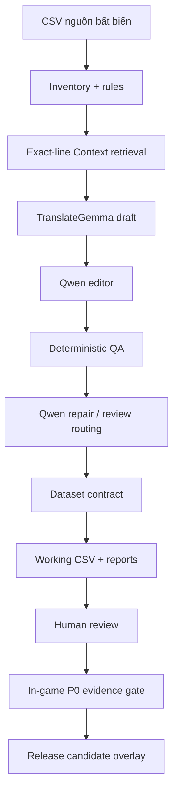
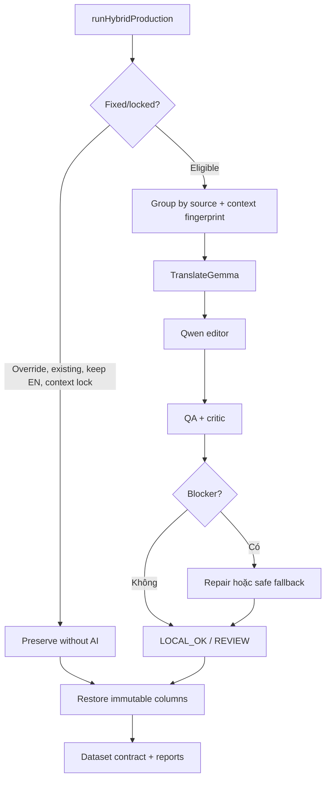
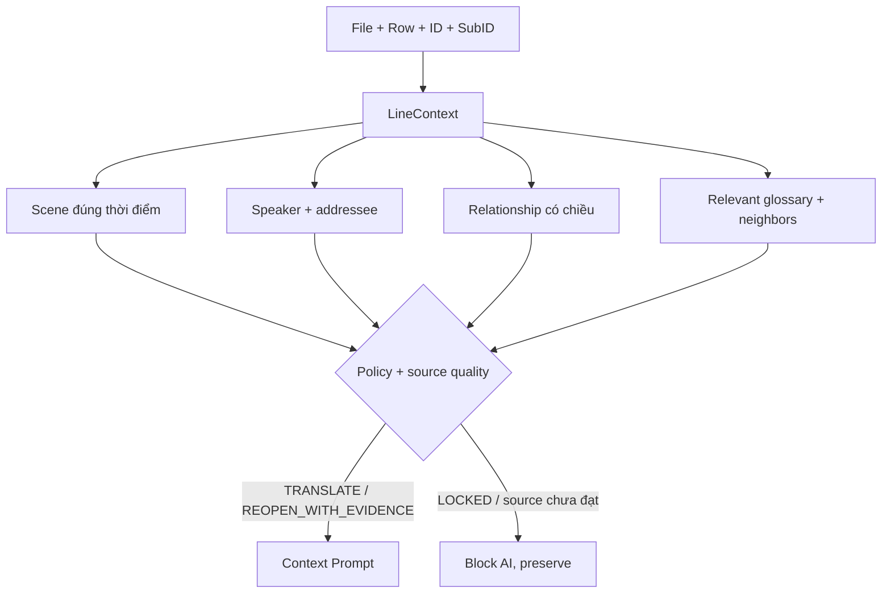

# Codemap — GBFR Local Translator

## 1. Ranh giới hệ thống

Phần tool kết thúc ở working CSV, report và release gate. Việc inject dùng overlay Reloaded-II/Relink Mod Manager; không encode `.msg` tổng quát và không sửa nhị phân trực tiếp.

## 2. Bản đồ module

| Module | Vai trò | Gọi/được gọi bởi | Dữ liệu bất biến liên quan |
|---|---|---|---|
| `src/hybrid-cli.mjs` | Entry point doctor, benchmark, production | gọi `hybrid.mjs` | đường dẫn input/config |
| `src/hybrid.mjs` | Orchestrator model, checkpoint, grouping, output | gọi `qa`, `rules`, `translation-context`, `contracts` | English/Japanese, token, line shape |
| `src/rules.mjs` | Phân loại dòng, whitelist, glossary, override | được gọi bởi `hybrid`, `beta3/4-review` | policy tên riêng/Skill/Trait/Sigil |
| `src/qa.mjs` | QA token, số, newline, whitespace, English leak | được gọi sau từng candidate | tag/token/placeholder/icon |
| `src/translation-context.mjs` | Adapter Context Layer vào production | gọi `context-store` | exact line key, lock policy |
| `src/context-store.mjs` | Validate và retrieve 5 bảng context | gọi JSON database | scene order, source confidence |
| `src/contracts.mjs` | Khóa số dòng, thứ tự và source columns | gọi trước/sau production | File/Row/ID/SubID/EN/JP |
| `src/release-gate.mjs` | Chặn release nếu thiếu human review/P0 | gọi sau production | evidence, rollback |
| `src/beta3-review.mjs` | Lịch sử biên tập Beta 3 | CLI riêng | checkpoint cũ |
| `src/beta4-review.mjs` | Lịch sử sửa nhóm rủi ro Beta 4 | CLI riêng | placeholder/glossary |
| `src/csv.mjs` | Parse/serialize CSV 1:1 | mọi pipeline CSV | cột và dòng |

## 3. Luồng production chi tiết

## 4. Luồng Context Layer

Context Database production được giữ ngoài repository. GitHub chỉ chứa fixture tổng hợp để chứng minh exact-line retrieval, khóa dòng và loại trừ future context mà không công bố dữ liệu dự án.

## 5. Cổng kiểm soát

| Cổng | Chặn lỗi gì | Tự động | Cần người |
|---|---|---:|---:|
| Input contract | trùng exact key | Có | Không |
| Context policy | dịch lại dòng locked, future leakage | Có | Chỉ khi mở khóa |
| Placeholder/token QA | mất tag, số, token, newline | Có | Khi fallback/review |
| Dataset contract | đổi ID/source/số dòng/thứ tự | Có | Không |
| Human review | lore, story, xưng hô quan trọng | Không | Có |
| P0 release gate | chưa test cài/boot/UI/combat/gỡ/rollback | Gate tự động | Bằng chứng do người test |

## 6. Phạm vi CodeGraph

CodeGraph chỉ index `src/`, `tests/`, `config/` và tài liệu. `data/**/*.csv`, `data/**/*.json`, `runs_hybrid`, `.msg`, ZIP và `node_modules` bị loại để graph phản ánh code thay vì corpus/build artifact.
